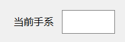
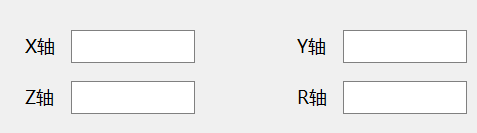
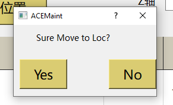
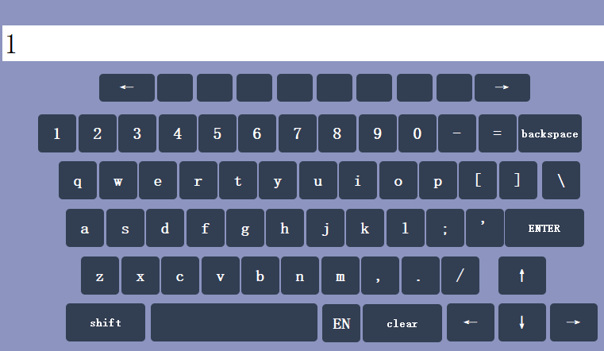
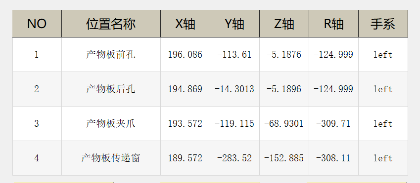

***
# 自定义QHBoxLayout 包含QLabel和QLineEdit
- 
- https://github.com/CodingKilling/GitLab_Jimi/blob/main/E009/SharedComponents/include/HgtTemplateWidget/HHboxLblEdt.h
***
# 自定义坐标控件，坐标，x，y，z，r
- 
- https://github.com/CodingKilling/GitLab_Jimi/blob/main/E009/SharedComponents/include/HgtTemplateWidget/HFrameXyzrLocation.h
***
# 自定义QMessageBox
- 
- https://github.com/CodingKilling/GitLab_Jimi/blob/main/E009/SharedComponents/include/HgtTemplateWidget/HMessageBox.h
- https://github.com/CodingKilling/GitLab_Jimi/blob/main/E009/SharedComponents/source/HgtTemplateWidget/HFmTemplatePlateLoc.cpp   第230行
***
# 自定义QLineEdit，双击弹出软键盘
- 
- https://github.com/CodingKilling/GitLab_Jimi/blob/main/E009/SharedComponents/include/HgtTemplateWidget/HLineEdit.h
***
# 自定义表格QTableView，自适应大小
- 
- https://github.com/CodingKilling/GitLab_Jimi/blob/main/E009/SharedComponents/include/HgtTemplateWidget/HTableViewFixedAuto.h
***

# 自定义属于Widget 的Group,可以避免过多槽函数
- 定义 https://github.com/CodingKilling/GitLab_Jimi/blob/main/E015/E015DailyBasic/SharedComponents/src/QSwitchButtonGroup.h
- 用法 https://github.com/CodingKilling/GitLab_Jimi/blob/main/E015/E015DailyBasic/HGTPeripheralCircuits/HGTPeripheralCircuits.cpp

