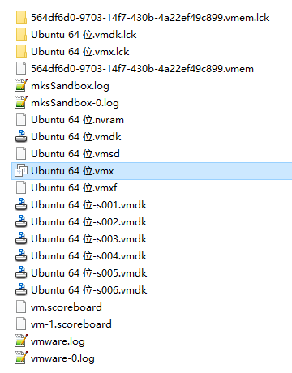
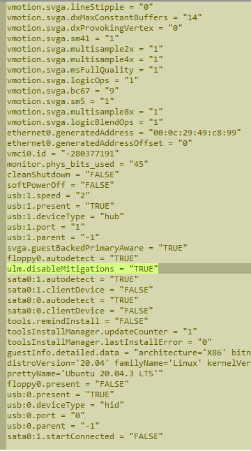

# 打开出现虚拟机正在使用
 点击获取所有权，弹出“无法打开虚拟机
 获取所有权失败。这种情况一般是VM异常关闭导致
 进入VM虚拟机的存放目录，删除后缀为.lck的文件即可
***
# VMware Player关闭侧通道缓解
在镜像安装位置找到虚拟机配置文件 *.vmx，如下图

 用文本编辑软件打开，添加如下内容
ulm.disableMitigations = "TRUE"

添加之后如下图

***

