Windows平台下搭建Git服务器的图文详解及教程
Git没有客户端服务器端的概念，但是要共享Git仓库，就需要用到SSH协议（FTP , HTTPS , SFTP等协议也能实现Git共享，此文档不讨论），但是SSH有客户端服务器端，所以在windows下的开发要把自己的Git仓库共享出去的话，就必 须做SSH服务器
Git服务现在独树一帜，相比与SVN有更多的灵活性，最流行的开源项目托管网站Github上面，如果托管开源项目，那么就是免费使用的，但是闭源的项目就会收取昂贵的费用，如果你不缺米，那么不在本文讨论的范围内，既然这样，我们可以自己搭建我们的Git服务器。
国内使用Windows Server平台的用户占大多数，那么本文就来讨论如何在Windows平台下搭建Git服务器。
第一步：下载Java，下载地址 http://www.java.com/zh_CN/
根据系统位数下载，32的下载32的，64的下载64的

第二步：安装Java.安装步骤不再详述。
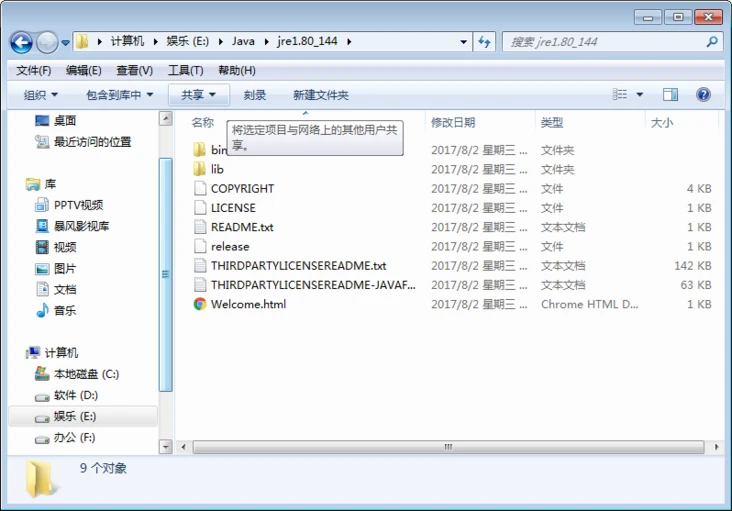

第三步：配置Java环境变量
右键”计算机” => ”属性” => ”高级系统设置” => ”高级” => “环境变量” => “系统变量”。
1、新建：
变量名：JAVA_HOME
变量值：D:Program Files (x86)Javajdk1.6.0_21【具体要根据你自己的安装路径，我的是安装在D盘的】
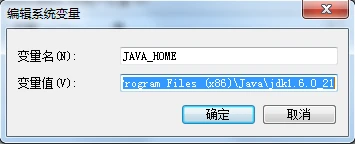
2. 新建：（切记，在跟别的变量值的时候必须加分号; 要不会报错的）
变量名：CLASSPATH
变量值：%JAVA_HOME%/lib/dt.jar;%JAVA_HOME%/lib/tools.jar

3.　添加：找到PATH变量，选择编辑。把%JAVA_HOME%/bin;%JAVA_HOME%/jre/bin添加到”变量值”的结尾处。 图片描述
第四步：验证Java是否安装成功。
打开命令窗口=> 输入CMD => 确定。

在命令窗口中，输入java命令：javac,回车，如果出现如下信息，说明安装成功。
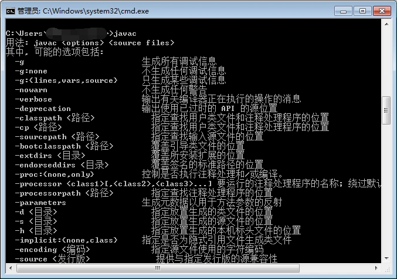

第五步：下载Gitblit.下载地址：http://www.gitblit.com/
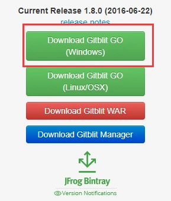

第六步：解压缩下载的压缩包即可，无需安装。
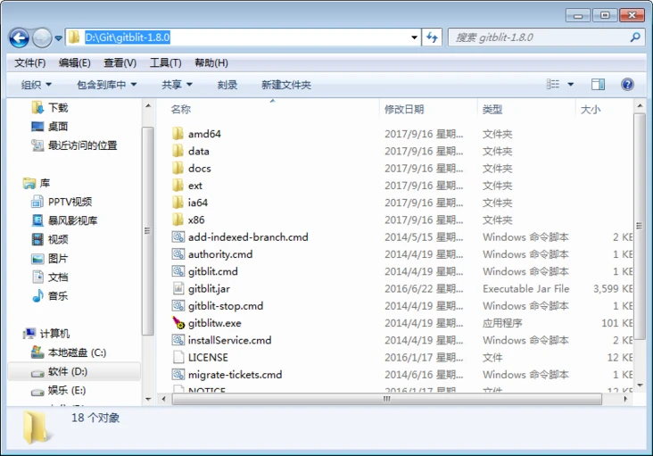

第七步：创建用于存储资料的文件夹
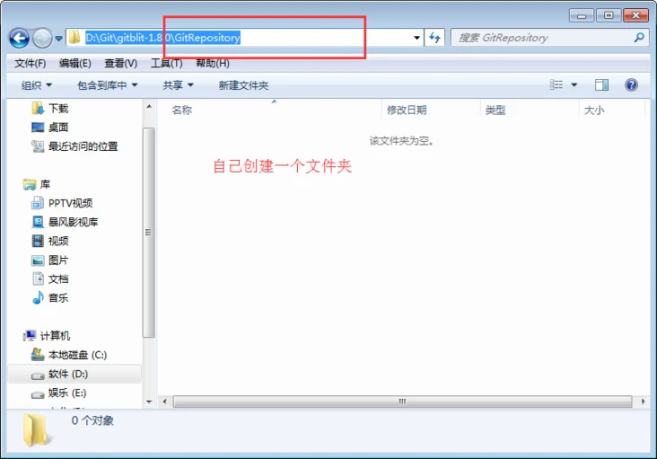

第八步：配置gitblit.properties 文件。
1、找到Git目录下的data文件下的defaults.properties文件，“记事本”打开。
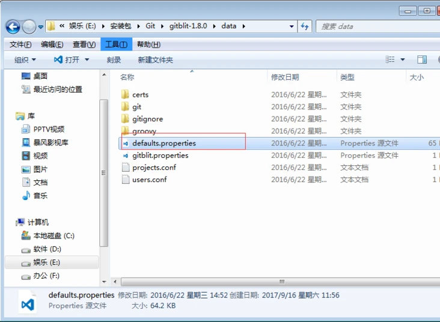

2、找到git.repositoriesFolder(资料库路径)，赋值为第七步创建好的文件目录。
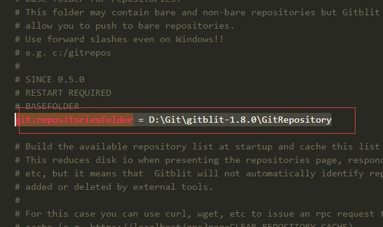

3.找到server.httpPort，设定http协议的端口号
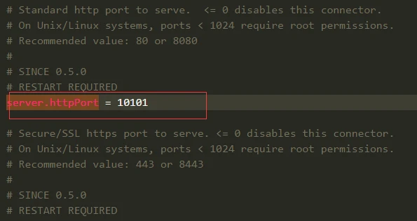

4.找到server.httpBindInterface，设定服务器的IP地址。这里就设定你的服务器IP或本地IP。
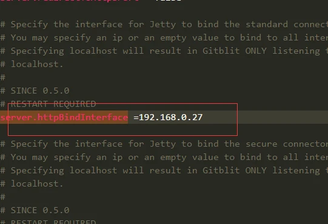

5.找到server.httpsBindInterface，设定为localhost
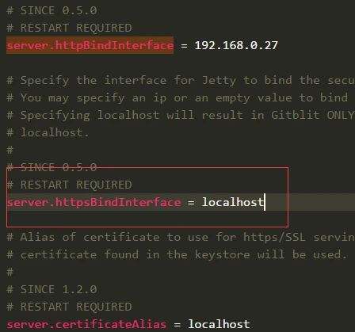

6.保存，关闭文件。
第九步：运行gitblit.cmd 批处理文件。
1、找到bitblit目录中的gitblit.cmd文件，双击。
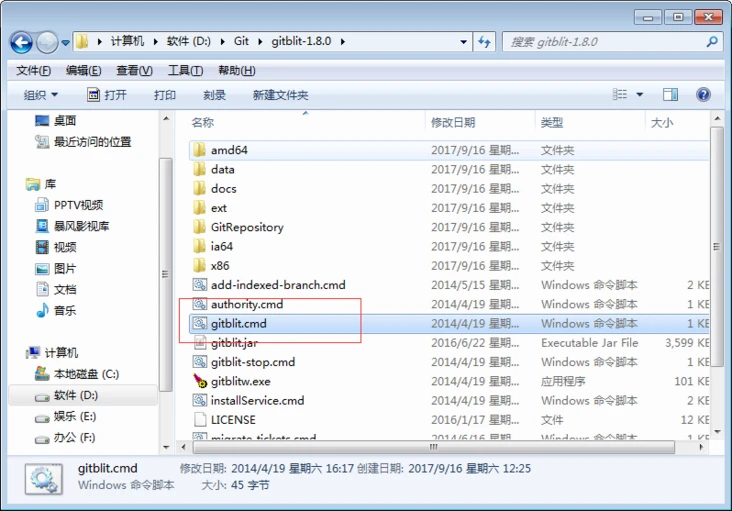

2.运行结果如下，运行成功。
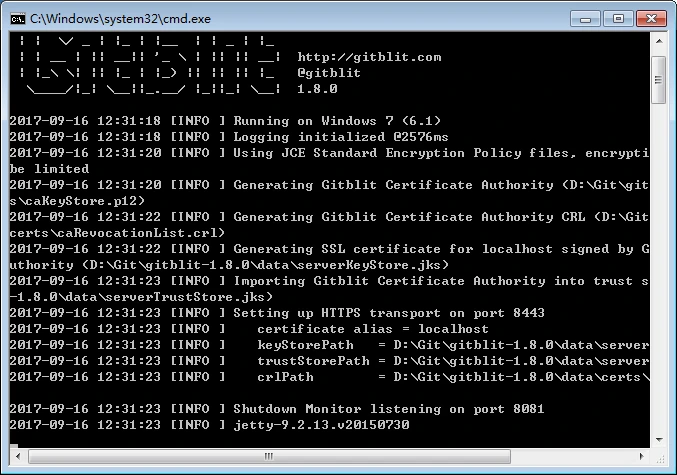
第十步：在浏览器中打开,现在就可以使用GitBlit了。

第十一步：设置以WindowsService方式启动Gitblit.
1、在Gitblit目录下，找到installService.cmd文件
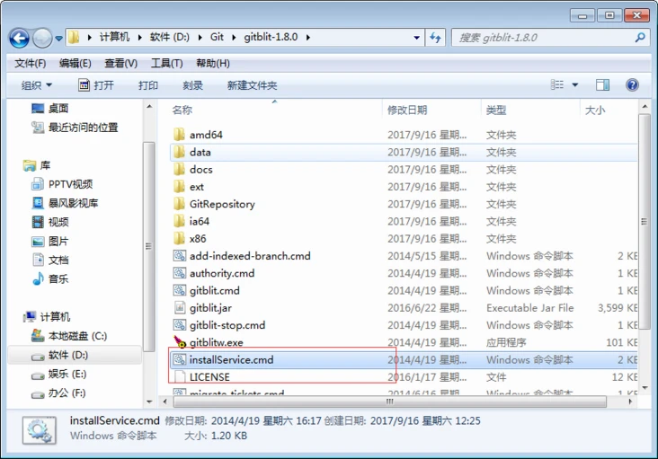

2.用“记事本”打开。
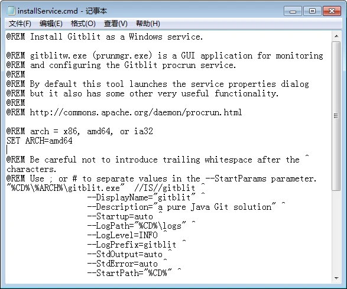

3.修改 ARCH
32位系统：SET ARCH=x86
64位系统：SET ARCH=amd64
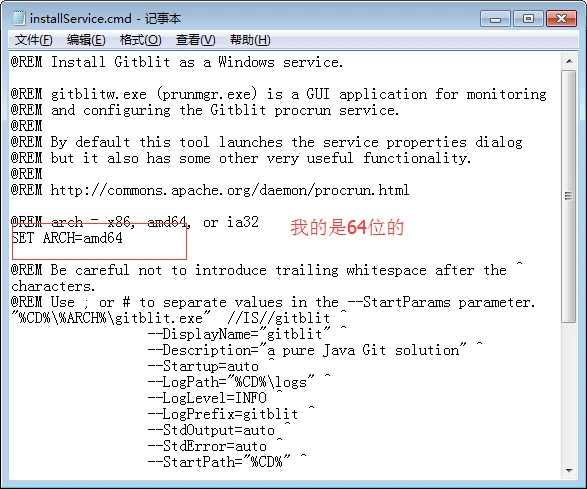

4.添加 CD 为程序目录
SET CD=D:GitGitblit-1.6.0(你的实际目录)
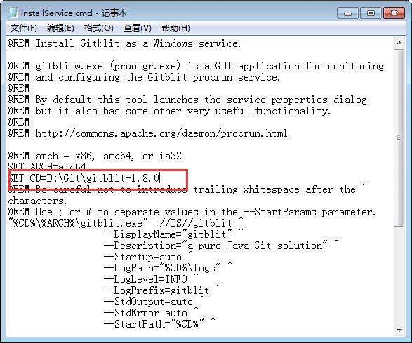

5.修改StartParams里的启动参数，给空就可以了。 1gif
6.保存，关闭文件。
第十二步：以Windows Service方式启动Gitblit.
1.双击Gitblit目录下的installService.cmd文件(以管理员身份运行)。
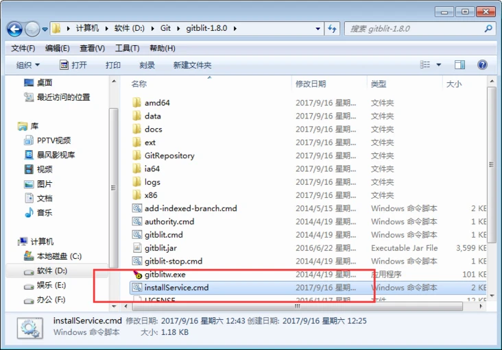

2.在服务器的服务管理下，就能看到已经存在的gitblit服务了。
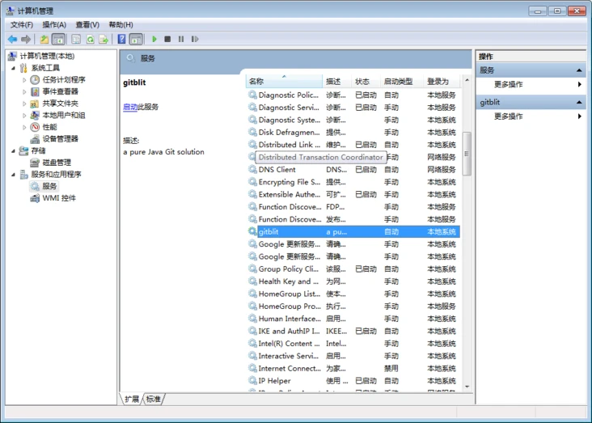