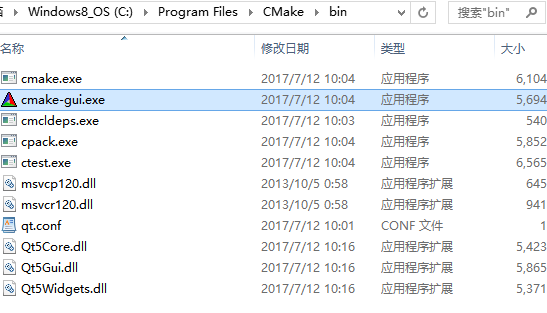
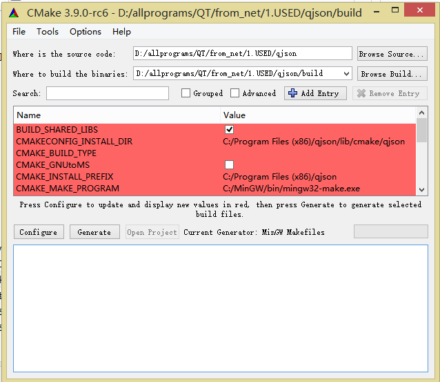
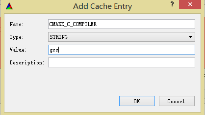
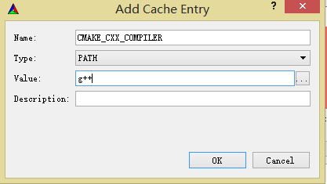
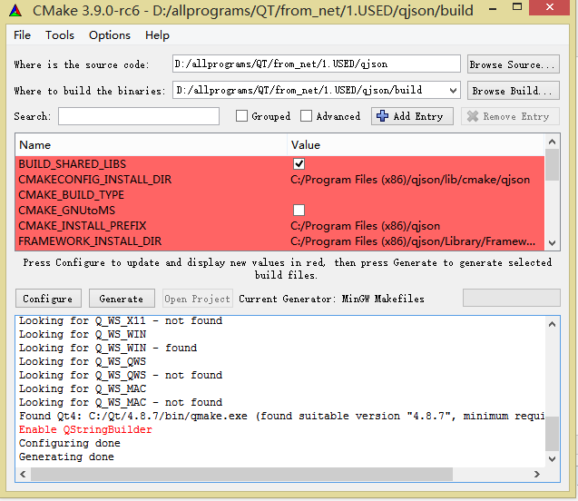
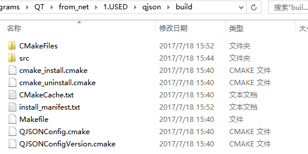
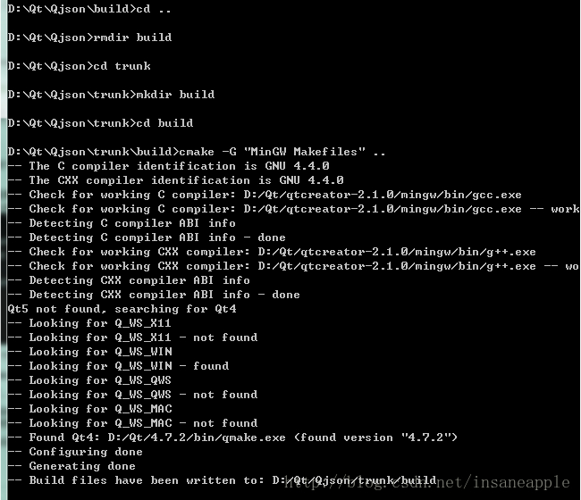
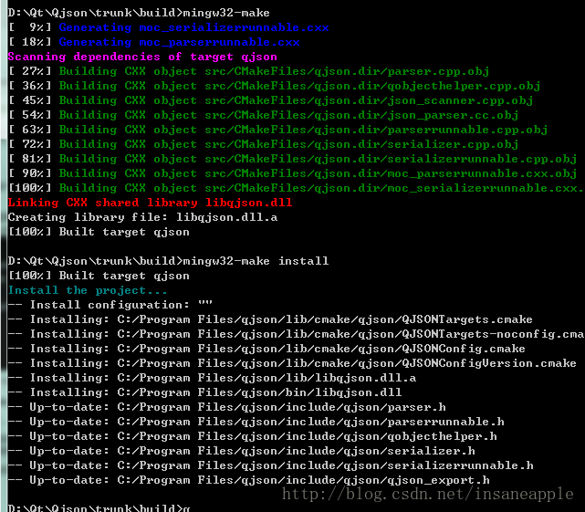
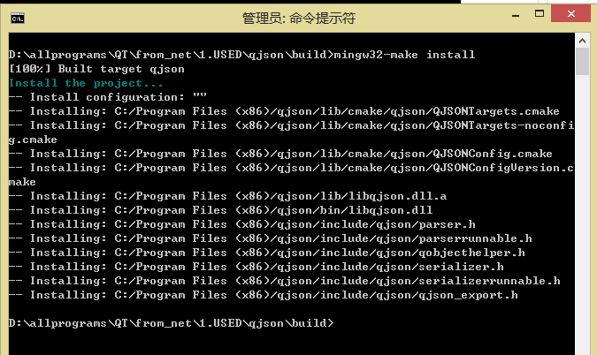
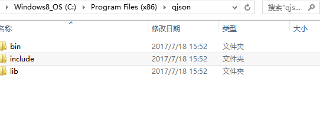

- windows下QJson的编译和安装

Qjson clone地址：https://github.com/flavio/qjson 版本0.9.0
Qjson编译需要用cmake，cmake下载地址：https://cmake.org/download/ 下载cmake-3.9.0-rc6-win64-x64.msi 安装地址：C:\Program Files\CMake\bin，并且将路径加入到环境变量里。
**1、进入Qjson目录**

**2、创建build目录 mkdir build，并进入build目录**

**3、cmake ..**

***
**如果此处有VS编译器工具链，没有报错，那么直接打开工程文件ALL_BUILD.vcxproj, 进行build 就可以**
***

由于执行 cmake ..  命令会报错误

CMAKE_C_COMPILER    CMAKE_CXX_COMPILER  未指定即  c编译器和c++编译器未指定。

故采用cmake\bin目录下的cmake-gui.exe工具执行，比较方便，可以指定编译器

打开工具，如下指定source code 和build 目录：

通过Add Entry添加C和C++编译器，注意由于本机已经安装mingw32，故gcc.exe和g++.exe目录已经在环境变量中

故只需填写以下两条即可
 

然后分别单击configure和generate，在build目录下生成makefile文件。注意：在点击configure后会弹出对话框，选择指定生成的工程文件类型，本人选择mingw32，具体的图忘记截了，不好意思，不过相信你懂得！作用其实跟网上的执行cmake -G "MinGW Makefiles" 同。

**4、管理员进入命令终端，cmd**

进入build目录，执行mingw32-make，成功后继续执行mingw32-make install，生成的目录在工具的配置项里有显示：CMAKE_INSTALL_PREFIX。以下前两张图是网上的图，最后一张是我最后成功的图。

**5、最后生成的目录为**

bin中的dll就是我们需要的。把三个目录移到你需要使用的工程的目录下面。在pro文件加入INCLUDEPATH+=../include

LIBS +=-L.. -llib/qjson
这个目录要看你自己的设置了.比如我是Qjsontest 目录 这个三个目录放在这个目录下面。对了我把dll库移动到lib文件夹了，编译不报错就说明成功.
具体根据自己的情况设置