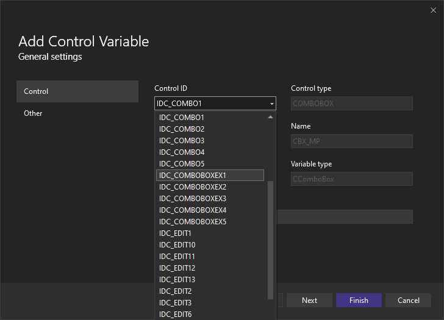
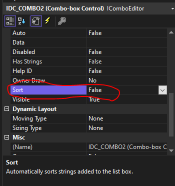

# COMBOBOX添加内容和设置默认
```
cbx_test.AddString(_T("1"));
cbx_test.AddString(_T("2"));
cbx_test.AddString(_T("3"));
cbx_test.SetCurSel(1);		// 选择第二个参数
```
***
# COMBOBOX 下拉框第一次不触发响应
-	**将IDC_COMBO改成IDC_COMBOBOXEX1**
- 
***
# COMBOBOX 设置默认参数不生效
- 右键-propreties-把Sort改成False
- 