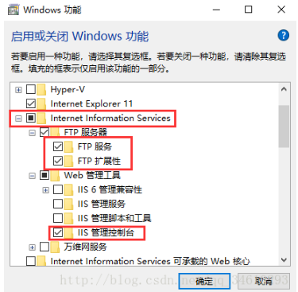
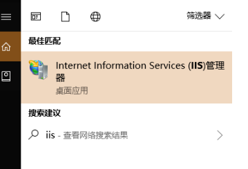
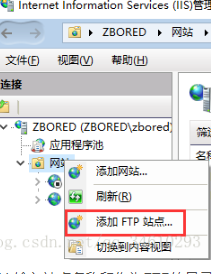
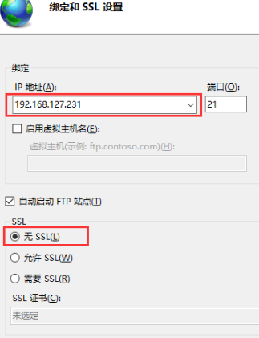
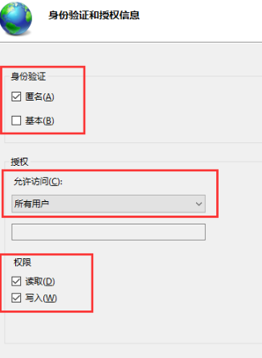
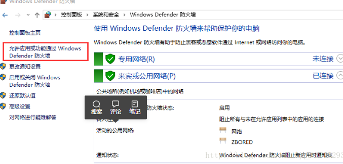
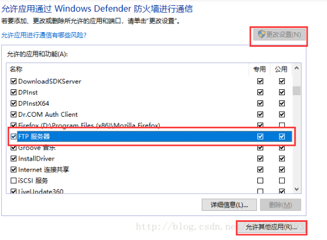
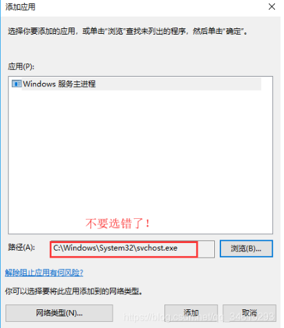

# ftp 上传丢失解决
- 进入ftp以后首先输入 bin 进入二进制模式，然后再上传 

***
- get file  下载 
- put file  上传
- lcd  相当于cd
***

# Win10开启FTP
- 1.控制面板>程序>启用或关闭Windows功能>…
(控制面板可在 桌面右键>个性化>主题>桌面图标设置>勾选控制面板>确定)

- 2.小娜搜索IIS打开IIS
- 
- 3.右击网站添加FTP站点
- 
- 4.输入站点名称和作为FTP的目录
- 
- 5.IP地址填FTP本机IP，选择无SSL
- 
- 6.根据需要选择身份验证，授权与权限
- 
- 7.控制面板>系统和安全>防火墙>允许应用或功能通过Window防火墙>...
- 
- 8.点击更改设置，勾选FTP服务器&专用&公用
- 
- 9.点击允许其它应用,选择C:\Windows\System32\svchost.exe然后添加，最后确定。
- 
- 10.文件访问ftp:// IP 试试吧！
- 