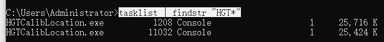

- VS调试过程中出现进程卡死，停止运行后依旧卡死
- 在后台任务管理器也找不到工程的进程名字。
# 使用一下方法强制关闭
- 打开CMD窗口输入
- tasklist | findstr  "HGT*"	（HGT是进程关键字）
- 
- taskkill /PID 1208 -f -t
- 
- 这个时候把PID改成 6520
- taskkill /PID 6520 -f -t
- 同样 taskkill /PID 11032 -f -t
***

# 以上方法不成功，也有可能USB口被锁定，考虑重新插拔USB口外设