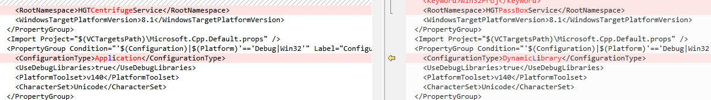

- 导入lib库在执行过程中出现错误
```
Exception thrown at 0x00043B80 in HGTCentrifugeManage.exe: 0xC0000005: Access violation executing location 0x00043B80.

If there is a handler for this exception, the program may be safely continued.

```
- 注意： 在编译lib库的工程时候，需要在vcxproj文件内把ConfigurationType改成DynamicLibrary 如下图
- 

***
- 如果执行过程中出现找不到 lib文件对于的exe文件，这时候将
```
<PreprocessorDefinitions>WIN32;_DEBUG;_WINDOWS;%(PreprocessorDefinitions);DLL_EXPORT=__declspec(dllexport);</PreprocessorDefinitions>
修改成
<PreprocessorDefinitions>WIN32;_DEBUG;_CONSOLE;%(PreprocessorDefinitions);DLL_EXPORT=__declspec(dllexport);</PreprocessorDefinitions>
```