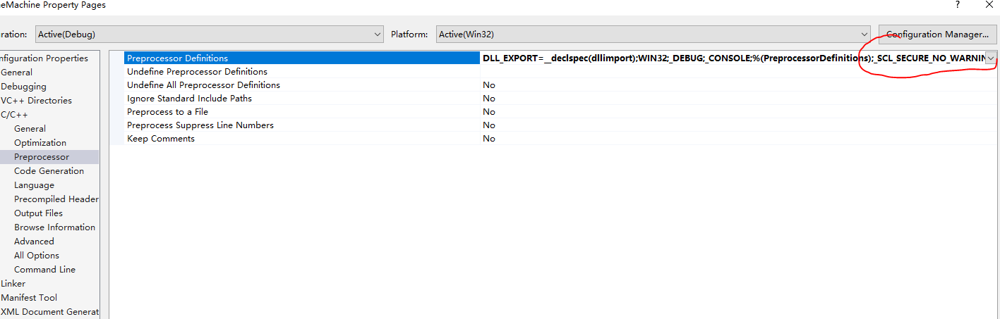

# LINK2019
```
 LNK2019: unresolved external symbol _WinMain@16 referenced in function "int __cdecl invoke_main(void)" (?invoke_main@@YAHXZ)

solution： Linker settings -> System". Change the field "Subsystem" from "Windows" to "Console" 
```

****
***

# Protobuf 

```
无法解析的外部符号  "class google::protobuf::internal::ExplicitlyConstructed<class std::basic_string<char,struct std::char_traits,class std::allocator > >

solution 1： 在生成的头文件中添加  #define PROTOBUF_USE_DLLS
solution 2:  在c/c++ -> preprocessor ->	preprocessor Definition 添加 PROTOBUF_USE_DLLS
```

```
 warning C4003: not enough actual parameters for macro 'min'
 error C2589: '(': illegal token on right side of '::'
 // 属于windefmin.h内部min和limits.h冲突

// 可能不生效， 推荐第二种
solution 1： 在头文件包含之前 #define NOMINMAX 	
solution 2： #undef min
			 #undef max
```


***
***

# LNK1120
```
1>main.obj : error LNK2001: unresolved external symbol "public: static struct QMetaObject const QssFontFactory::staticMetaObject" (?staticMetaObject@QssFontFactory@@2UQMetaObject@@B)
1>D:\Git_Working\E015Basic\E015\..\build\Debug\HGTCentrifugeManage.exe : fatal error LNK1120: 1 unresolved externals

导入lib库出现类似问题，可能是vcxproj文件引起
解决：
打开vcxproj文件，找到PreprocessorDefinitions 内的DLL_EXPORT
把DLL_EXPORT=__declspec(dllexport) 改成 DLL_EXPORT=__declspec(dllimport)
```

***
# 如果vs 刚刚安装找不到C++的库和头文件
- 这个时候可以不卸载，重现点击安装包，点击修复，这个时候选中C++相关的库，进行在线下载安装。

***
***
# To disable this warning.   use -D_SCL_SECURE_NO_WARNINGS.
```
Severity	Code	Description	Project	File	Line	Suppression State
Error	C4996	'std::copy::_Unchecked_iterators::_Deprecate': Call to 'std::copy' with parameters that may be unsafe - this call relies on the caller to check that the passed values are correct. 
To disable this warning, use -D_SCL_SECURE_NO_WARNINGS. See documentation on how to use Visual C++ 'Checked Iterators'	HAllinoneMachine	c:\program files (x86)\microsoft visual studio 14.0\vc\include\xutility	2372	

```
- 解决办法: 在 `preprocessor definition `里面添加宏定义 `_SCL_SECURE_NO_WARNINGS` 如图
- 
