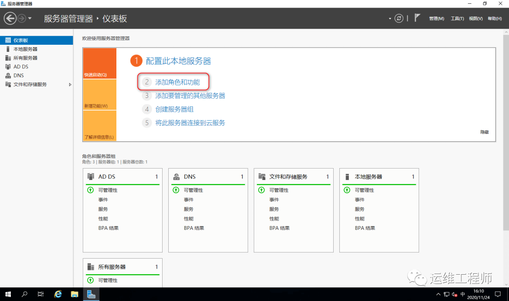
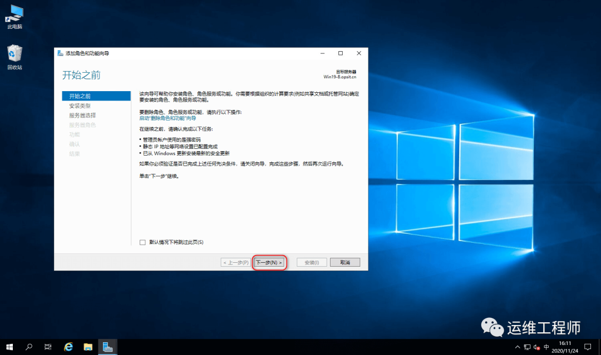
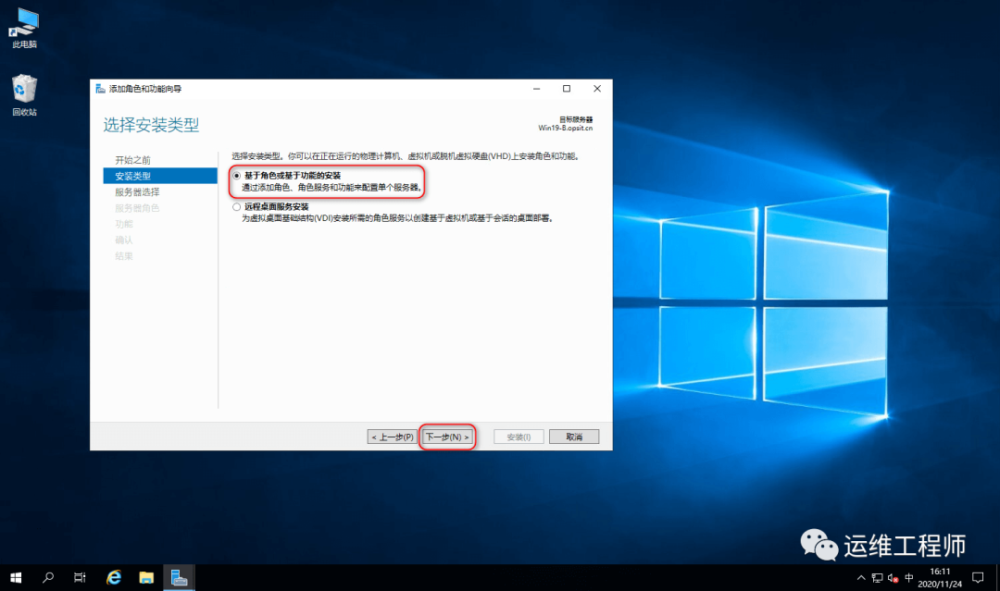
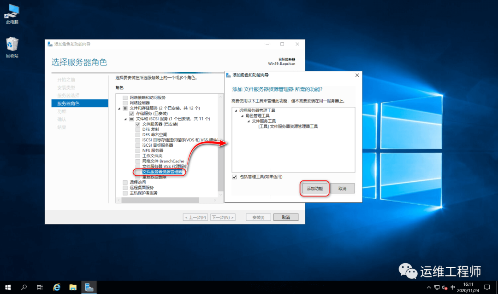
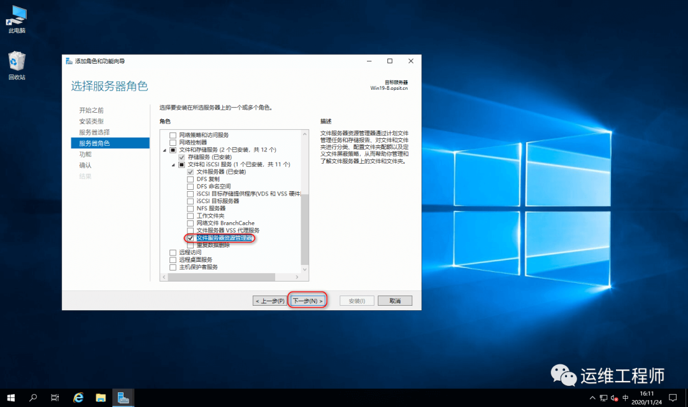
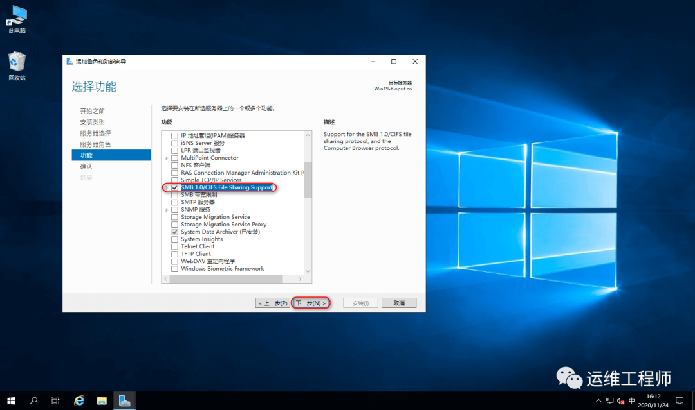
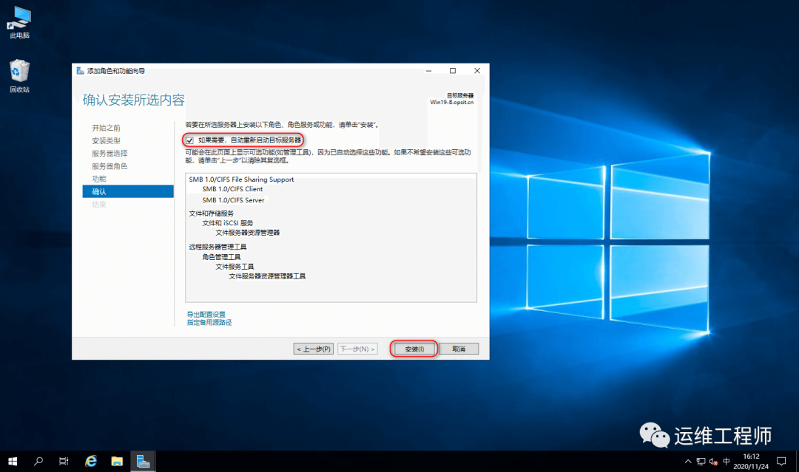
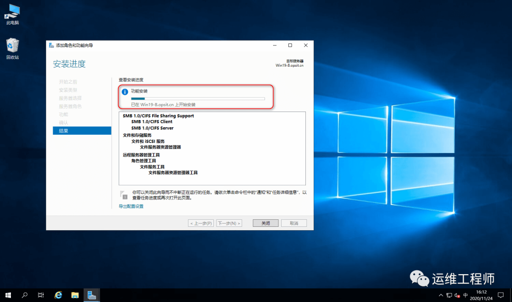
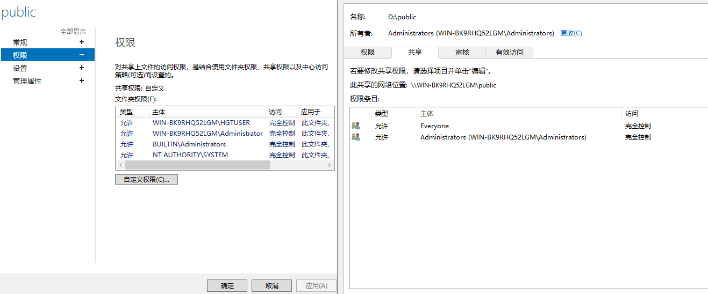

-  步骤1

- 步骤2 

- 步骤3

- 步骤4

- 步骤5

- 步骤6

- 步骤7

- 步骤8

***
# 权限设置
**创建账户**
- win + r 输入 lusrmgr.msc 进入本地用户和组 新建用户或者组，设置密码
**设置共享方式1 -  普通共享**
- 右键文件夹 - 属性 - 共享 ，然后设置账户权限
**设置共享方式2 - 创建samba**
- 右键 - 管理 - 文件和存储服务 - 共享 - 新建共享， 选中共享的目录
- 设置权限 如图，要添加一个账户，需要在 权限  和 共享 栏目内同时添加该用户才可以
