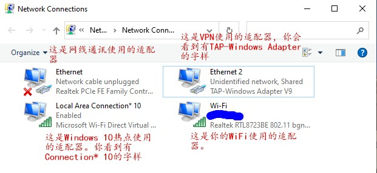
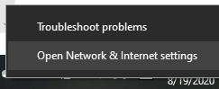
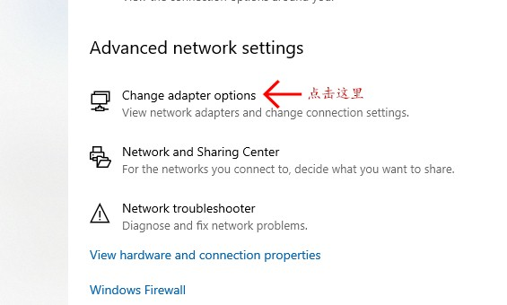
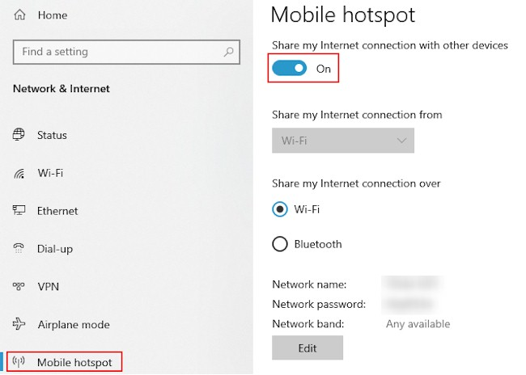
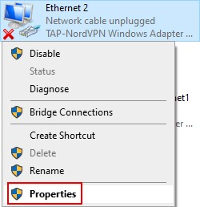
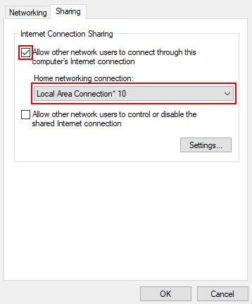
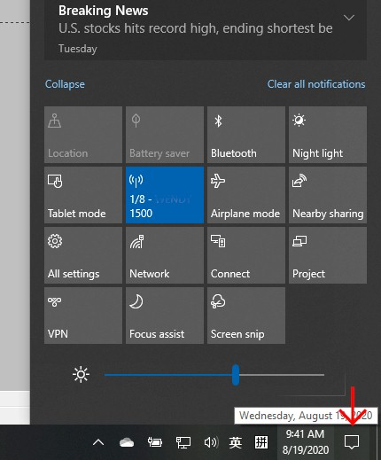

配置Windows 10热点来共享VPN的逐步指南
现在，就让我们来一步一步地完成配置工作，首先，我让你学些一些新的知识，很简单，也很容易理解，这有助于你在执行将要做的工作时避免出错。另外，如果你在以后的使用中遇到了问题，也有利于你找到问题所在，并想出解决问题的方法。

你的电脑需要一个出口来进行与外界的通讯，对不对？如果你可以命名它，你会给它取什么名字？门，还是出口？如果电脑有两个出口呢？你如何命名？叫出口1和出口2；或者是门1和门2？

在电脑上，它有一个别人取的，对你来说很奇怪的名字，适配器。不过你可能会看到各种可能的名字。

如果你的电脑使用线缆来进行通讯，对应的，会有一个出口；如果你的电脑使用无线网络来通讯，对应的，会有另一个无线通讯专用的出口；同样的道理，有VPN专用的出口，以及无线热点专用的出口；每一个出口，都有一个特定的奇怪名字。

这些你电脑上的出口，它们的样子在电脑上看起来是这样的：

Win10电脑热点共享VPN连结-1
怎样去看到上面那样的图示呢？

在你Windows 10电脑屏幕的右下角，找到像显示器一样的图标，使用鼠标右键点击一下，然后在弹出的菜单中选择“打开网络和互联网设置-Open Network & Internet settings”

Win10电脑热点共享VPN连结-2
然后，在出现的设置页面中找到“更改网络适配器选项-Change adapter options”，你就会看到所有电脑用来进行通讯的“出口”（网络适配器）了。

Win10电脑热点共享VPN连结-3
设置Windows 10的无线热点来共享VPN连结
在你的Windows 10电脑上，找到设置（Settings）> 网络和互联网（Network & Internet）> 手机热点（Mobile hotspot）;
先选择WiFi，再打开“手机热点-Mobile hotspot”的开关；你可以修改热点使用的名字和密码，按下面的编辑按钮去进行修改，如图：

Win10电脑热点共享VPN连结-4
接下来，再去设置（Settings）> 网络和互联网（Network & Internet）>更改网络适配器选项（Change adapter options）。就是上面讲到过的，点击它。这时，你就看到所有电脑通讯时使用的“出口”（网络适配器）；
找到那个VPN通讯使用的“出口”（有TAP-Windows字样的那个），用鼠标右键点击它，在弹出的菜单上点选最后一个命令-属性（Properties）

Win10电脑热点共享VPN连结-5
在出现的窗口中选择共享（Share）表签，然后勾选最上面的选项—让其他网络用户连结并通过这台电脑的互联网连结（Allow other network users to connect through this computer’s internet connection）。并在下面的下拉框中找到Windows 10热点使用的“出口”（适配器），然后点击下面的确定（OK）按钮完成设置。选择Local Area Connect 

Win10电脑热点共享VPN连结-6
现在，所有你需要做的配置工作就完成了。

以后，每当你要使用Windows 10的热点来为其它设备提供VPN共享连结，到你Windows 10电脑屏幕的右下角，找到那个像对话框一样的图标，点击它。这是Windows 10会弹出快捷菜单栏，在其中的快捷命令部分你就可以找到打开无线热点的按钮，点击一下就开启了热点。

