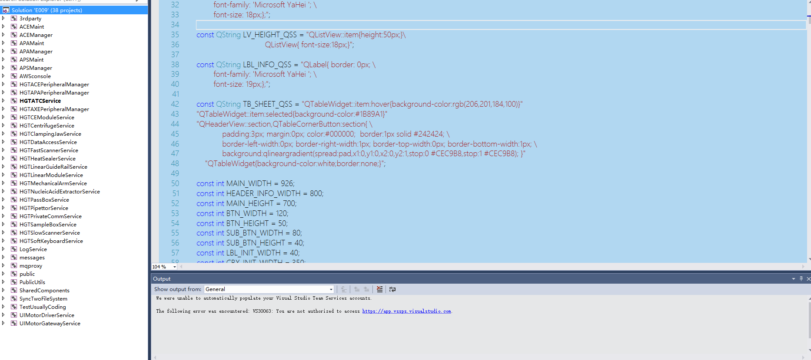
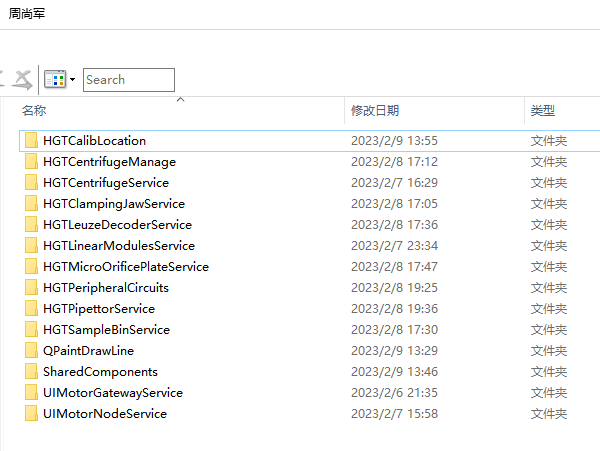
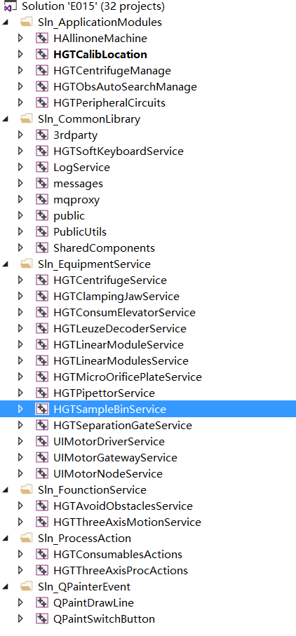

# 服务器 IP - 10.168.3.208
# 已有服务
- **Gitblit**   &nbsp; http://10.168.3.208:8442/users/
- **禅道**	&nbsp; http://10.168.3.208/zentao/user-login.html
- **SVN**		&nbsp; https://WIN-BK9RHQ52LGM/svn/HGTSVNRepo/
- **Public Private Release 共享** &nbsp;  \\\10.168.3.208\public
- **自动备份，从D盘备份到E盘**
*****
- 
*****
# E009

***
***
# 每个电机都有默认参数和传感器参数
***
***
# 代码视频讲解
```
\\10.168.3.208\周尚军
```
- 
*****
# 工程结构
- 
- **大的目录结构一共分为六个模块， 分别是**
- **Sln_ApplicationModules** &nbsp;  应用程序
	- HAllinoneMachine	
	- HGTCalibLocation	&nbsp; 	位置标定，设备维护模块
	- HGTCentrifugeManage	&nbsp; 离心机应用程序
	-  HGTCentrifugeManage	&nbsp; 自动避障程序
	-  HGTPeripheralCircuits	&nbsp;  各个外设管理模块

- **Sln_CommonLibrary** &nbsp;  公共基础模块代码
	- 3rdparty	&nbsp;  第三方库
	- HGTSoftKeyboardService  &nbsp; 软键盘
	- LogService	&nbsp;	日志模块
	- messages		&nbsp;	消息内容，mqtt消息定义
	- mqproxy	&nbsp;	mqtt接口
	- public	&nbsp;	各个模块的抽象接口代码
	- PublicUtils	&nbsp;	串口外设接口
	- SharedComponents	&nbsp;	公共组件包括
		- 三轴操作器
		- Qss工厂，用来加载QSS
		- 自定义选择开关控件btnGroup
		- 自定义的QTableview
		
- **Sln_EquipmentService** &nbsp;  各个外设服务接口
	- HGTCentrifugeService  &nbsp; 离心机接口 
	- HGTClampingJawService  &nbsp; 夹爪接口 
	- HGTConsumElevatorService   &nbsp; 升降电机接口 
	- HGTLeuzeDecoderService &nbsp; 扫码枪接口 
	- HGTLinearModuleService &nbsp; 直线模组接口 (旧)
	- HGTLinearModulesService &nbsp; 直线模组接口 (新)
	- HGTMicroOrificePlateService  &nbsp; 微孔板压盖设备接口
	- HGTPassBoxService	&nbsp; 传递窗接口
	- HGTPipettorService  	&nbsp; 移液器接口
	- HGTSampleBinService  &nbsp; 样本仓接口
	- HGTSeparationGateService  &nbsp; 隔离门接口
	- UIMotorDriverService	&nbsp; 网关驱动器节点接口(旧)
	- UIMotorGatewayService  &nbsp; 网关驱动器网关接口
	- UIMotorNodeService  &nbsp; 网关驱动器节点接口(新)

- **Sln_FounctionService** &nbsp;  拓展功能相关模块接口
	- HGTAvoidObstaclesService		  &nbsp; 自动避障算法接口
	- HGTThreeAxisMotionService   &nbsp; 三轴连接云端服务程序接口

- **Sln_QPainterEvent** &nbsp;  拓展功能相关模块接口
	- QPaintDrawLine		&nbsp; 描画直线和矩阵图形接口
	- QPaintSwitchButton 	&nbsp; 选择开关控件接口

***
# 网关节点设备，默认要配置以下参数
- S3 下降沿停止并且清零
- S2 下降沿停止
- 
# 驱动器网关节点和设备端口号
- **离心机**
	- 开关门电机	&nbsp;	6
	- 离心电机			&nbsp; 5
- **夹爪端口**
	- COM口，视连接情况而定
-  **升降电机**
	- 耗材仓1  (核提耗材仓AB) 	&nbsp; 14
	- 耗材仓2  (Tips仓AB)	&nbsp; 13
	- 耗材仓3  (PCR板仓AB)	&nbsp; 12
	- 耗材仓4  (磁棒套AB)	&nbsp; 11
-  **直线模组上三轴**
	- x 轴 &nbsp; 31
	- y 轴 &nbsp; 32
	- 夹爪z &nbsp; 33
-  **直线模组下三轴**
	- x 轴 &nbsp; 7
	- y 轴 &nbsp; 9
	- 夹爪z &nbsp; 8
-  **传递窗**
	- 传递电机 &nbsp; 18
	- 传递窗门 &nbsp; 41
	- 传递窗处PCR门 &nbsp; 19
-  **移液器**
	- lift电机 &nbsp; 34
	- pip电机 &nbsp; 30
-  **样本仓**
	- 样本盘 &nbsp; 17
	- 升降电机 &nbsp; 16
	- 转管电机 &nbsp; 15
	- 样本仓门 &nbsp; 40
-  **隔离门**
	- 1号隔离门 (磁棒套AB)	&nbsp; 35
	- 2号隔离门 (PCR板仓AB) &nbsp; 36
	- 3号隔离门 (Tips仓AB)	&nbsp; 37
	- 4号隔离门 (核提耗材仓AB)&nbsp; 38
	- 5号隔离门 (垃圾桶门)&nbsp; 39