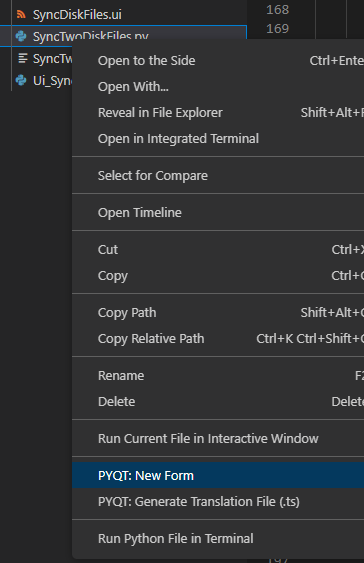
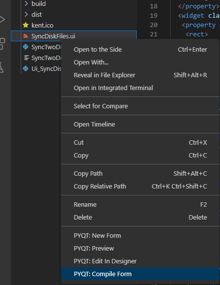

# 操作
- VSCode 选中.py 文件，右键 New Form 创建新的UI
- 
-
- 把.ui文件编译成 python UI文件如下
- 


# 头文件导入
```
from Ui_SyncDiskFiles import Ui_Form
from PyQt5 import QtCore, QtGui, QtWidgets
from PyQt5.QtCore import *
from PyQt5.QtGui import *
from PyQt5.QtWidgets import QApplication, QWidget, QPushButton, QMessageBox

```

# 功能
```
@pyqtSlot()
def btnFileA():
    print("A Press")

if __name__ == '__main__':
    app = QtWidgets.QApplication(sys.argv)
    MainWindow = QtWidgets.QMainWindow()
    ui = Ui_Form()
    ui.setupUi(MainWindow)
    ui.btnFileA.clicked.connect(btnFileA)						#connect 用法
    MainWindow.show()
    sys.exit(app.exec_())	
	
```