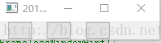

***
# 常用头文件
```
#include <QtGui/QLabel>
#include <QtGui/QWidget>
#include <QtGui/QVBoxLayout>
#include <QtGui/QPushButton>
#include <QtGui/QGridLayout>
#include <QtGui/QStackedWidget>		//进行多页面切换
#include <QtGui/QTreeWidget>		//树形控件，点击控件。
#include <QtCore/QTextCodec>
#include <QtCore/QCoreApplication>
#include <QtGui/QApplication>
#include <QtCore/QSettings>
#include <QtGui/QTreeWidgetItem>
#include <QtGui/QWSServer>
#include <QtCore/QDir>									//文件管理
#include <QtCore/QStringList>	
#include <QtGui/QPlainTextEdit>					//文本框
#include <QtCore/QByteArray>			// 相当于是QChar的一个vector<>
```
***
-  **QWidget**
```
 	wgt->resize(60,60); // 设置默认初始化大小，不影响鼠标拖拽放大缩小
		wgt->height(); // 获取高度,如果是自适应大小,需要再show(),以后调用
		wgt->width(); // 获取宽,如果是自适应大小,需要再show(),以后调用
```
***
-  **QHBoxLayout**
```
 	void QBoxLayout::addStretch(int stretch = 0)
	//函数的作用是在布局器中增加一个伸缩量，里面的参数表示QSpacerItem的个数，默认值为零，会将你放在layout中的空间压缩成默认的大小。
	//例如：一个layout布局器，里面有三个控件，一个放在最左边，一个放在最右边，最后一个放在layout的1/3处，这就可以通过addStretch去实现。
	//例子：用addStretch函数实现将nLayout的布局器的空白空间平均分配
	//在*.cpp中实现下列代码：
//创建水平布局器
	QHBoxLayout *buttonLayout=new QHBoxLayout;
	button1=new QPushButton();
	button2=new QPushButton();
	button3=new QPushButton();
	buttonLayout->addStretch(1);  //增加伸缩量
	buttonLayout->addWidget(button1);
	buttonLayout->addStretch(1);  //增加伸缩量
	buttonLayout->addWidget(button2);
	buttonLayout->addStretch(1);  //增加伸缩量
	buttonLayout->addWidget(button3);
	buttonLayout->addStretch(6);  //增加伸缩量
	//void QWidget::setContentsMargins(int left, int top, int right, int bottom)
	//Sets the margins around the contents of the widget to have the sizes left, top, right, and bottom.
	//The margins are used by the layout system, and may be used by subclasses to specify the area to draw in (e.g. excluding the frame).
	buttonLayout->setContentsMargins(0,0,0,0);
	setLayout(buttonLayout);
	//执行结果见下图
	//其中四个addStretch()函数用于在button按钮间增加伸缩量，伸缩量的比例为1:1:1:6，意思就是将button以外的空白地方按设定的比例等分为9份并按照设定的顺序放入buttonLayout布局器中。
```
- 
```
		hbl->insertWidget(0, m_tvObs, Qt::AlignLeft);		//插入widget到最前面位置
```
***
- **QLabel** 
```
	m_lbl->setAlignment(Qt::AlignCenter);		//设置字体居中
```

***
- **QPushButton btn**
```
		btn.setDisabled(true) 		//禁用
		btn.setEnabled(true) 		//启用
	
		btn.setCheckable(true);					//设置按钮可以点击状态,点击一下状态会发生改变.
		btn.setChecked(true);			//设置为已经点击过的状态

```

```
		QPixmap pixmap("../Picture/forward.png");
		btn.setIcon(pixmap);						//设置图片
		btn.setIconSize(QSize(pixmap.size()));		//调整大小
```

```
	// 设置圆圈,并且加载图片,btnSize表示正方形button的边长
		QString radiusQss = "QPushButton{ border:none; background:transparent; } \
                        QPushButton{border-radius:" + QString::number(btnSize / 2) + "px;}\\";

		//再button上面,放置,点击分别使用不同图片.
    	QString qssBgZarmFor = "QPushButton{border-image: url(../Picture/forwardBase.png);}"
															"QPushButton:hover{border-image: url(../Picture/forwardHover.png);}"
															"QPushButton:pressed{border-image: url(../Picture/forwardPress.png);}"              
    	QString qssZarmFor = radiusQss + qssBgZarmFor;
    	btn.setStyleSheet(qssZarmFor);
    	btn.setFixedSize(btnSize, btnSize);
```

```
		//btn按压触发间隔,可以通过设置以下条件设置pressed信号,true为触发,false则为普通clicked信号
		btn->setAutoRepeat(true);
		//btn->setAutoRepeat(false);			//关闭触发
		btn->setAutoRepeatDelay(1);
		btn->setAutoRepeatInterval(5);
```

* * *
- **QFile file**
    ```
		file.exists("文件名")			///文件存在返回true
	``` 

* * *

- **QFileInfo fileInfo**
```
 	fileInfo.fileName() 	//获取文件名
 	fileInfo.suffix() 		//获取后缀名
 	fileInfo.absolutePath() 	//获取绝对路径
 	fileInfo.absoluteFilePath() 		//获取绝对路径加文件
```
* * *

- **QDir dir**
	```
 		dir.mkpath("./AESDir") 		//来创建文件路径
 		dir.rmpath("./AESDir") 		//删除路径
 		setCurrent("./AESDir") 		//设置程序执行路径，相当于cd
		
		QDir dir;		//如过不存在目录 则创建
		if (!dir.exists(QString::fromStdString(dirName)))
		{
			dir.mkpath(QString::fromStdString(dirName));
		}
	```
* * *

- **QCoreApplication**
    ```
		QCoreApplication::applicationDirPath()  //获取程序默认运行路径，当前路径
	```
* * *

- **QMessageBox**
    ```
		QMessageBox::information(NULL, "", "ens succeed! quit!") 	//弹窗
	```

* * *

- **QString qstr**
    ```
		int hexnum = 255;
 		QString::number(hexnum, 16); //转换整型到16进制字符串
		
		qstr.startsWith("start")		//判断是否以字符串开头
		
		qstr = qstr.mid(strlen("pkg_"));	//截取"pkg_"以后的字符串	
		qstr = qstr.mid(0, index);				//从0开始截取，个数为index个
		
		QStringList listQstr = qstr.split("_");			//以"_"分割字符串
		
	
		QString str = " lots\t of\nwhitespace\r\n ";
		str = str.simplified();				//删除字符串的\n \t \r 之类字符
		// str == “lots of whitespace”;
		
		
		/* QString 转换const char* 乱码 */
		QString sysAxisCmd = "HGTThreeAxisMotionService.exe " + ipAddr;
		std::string trCmd = sysAxisCmd.toStdString();		//必须转换中间状态std::string,才能避免乱码
		const char *cmd = trCmd.c_str();
		
  ```

* * *

- **QPalette**
    ```
		QPalette pal(wgt->palette());
		pal.setColor(QPalette::Background, 0x0000FF);	//设置蓝色
	```

***
- **QReadWriteLock**
	```
		QReadWriteLock	m_FileAccessLock;  //读写锁
		m_FileAccessLock.lockForWrite(); 	//上锁
		m_FileAccessLock.unlock();				//解锁
	````
	
***
- **QRegExp** ，正则表达式限定字符串作用域
```
	QRegExp xyrRange("^-?([0-4]?[0-9]?\\d(\\.\\d{1,2})?)$");  //范围 0 - 399
	QRegExpValidator *pRangeXyr = new QRegExpValidator(xyrRange, this);
	m_edtXVal->setValidator(pRangeXyr);
```
***
- **QSettings**
- https://github.com/CodingKilling/GitLab_Jimi/blob/main/E009/APSMaint/RoutePlanning/QFmAddRoute.cpp
- 第541 和603行
***
- **QDateTime** 获取时间
```
	QDateTime dateTime(QDateTime::currentDateTime());
	QString qStrDate = dateTime.toString("yy-MM-dd hh:mm::ss");
```
***
- **QTcpServer**
- https://github.com/CodingKilling/GitLab_Jimi/blob/main/E009/HGTATCService/HGTATCService.cpp
***
- **QTimer::singleShot** 定时器 10毫秒开始执行
```
	QTimer::singleShot(10, this,SLOT(eventOperation()));

	单singleShot，表示它只会触发一次，发出一次信号，然后来执行槽函数。
	如果把槽函数设置成eventOperation（）,那么当定时器到达时候，就会执行这个函数，在这个函数中定时器又会再次发出信号，
	然后执行槽函数eventOperation，这样循环往复的，所以这是一个每隔10毫秒就执行一次的循环。一般我们会在线程定时刷新的操作里面使用这个函数。
```
***
- **QPainter**
```
void paintEvent(QPaintEvent *) {								//通过重写paintEvent实现
		QPainter painter(this);
		painter.setRenderHint(QPainter::Antialiasing);
		QPixmap pixmap("../Paint-Base-Bufferfly.png"); 

		painter.drawPixmap(20, 20, pixmap); 
		painter.drawPixmap(225, 20, 250, 159, pixmap); 
		painter.drawPixmap(20, 133, pixmap, 128, 0, 57, 46);

		painter.translate(0, 199);
		painter.drawTiledPixmap(0, 0, width(), height(), pixmap);			//画平铺
	}
	
void paintEvent(QPaintEvent *) {
		QPainter painter(this);
		painter.setPen(QPen(Qt::red, 5));
		QRect rect = QRect(20, 20, 200, 100);
		QFont font = this->font();
		font.setPointSize(50);
		painter.setFont(font);
		painter.drawText(rect, Qt::AlignHCenter | Qt::TextWordWrap, "Rect");
		painter.setPen(QPen(Qt::green, 5));
		auto bRect = painter.boundingRect(rect, Qt::AlignHCenter | Qt::TextWordWrap, "Rect");		//画矩阵
		painter.drawRect(bRect);
	}
	
```
***
- **QSizePolicy** 设置控件自适应大小，动态匹配
```
	QSizePolicy sizePolicy(QSizePolicy::Preferred, QSizePolicy::Expanding);			//Expanding表示大小自适应
	lineEdt->setSizePolicy(sizePolicy);
```
***
- **QTableView**
```
	tableView->horizontalHeader()->setResizeMode(QHeaderView::Stretch);		//设置表头自适应大小
```
***
- **QPixmap**
- 设置图片自动填充
```
	QImage Image;
	Image.load("../images/IconDrawRect/WorkBench.png");
	QPixmap pixmap = QPixmap::fromImage(Image);
	int with = this->width();//要显示的宽度
	int height = this->height();
	QPixmap fitpixmap = pixmap.scaled(with, height, Qt::IgnoreAspectRatio, Qt::SmoothTransformation);  // 饱满填充
```