当发生一下情况时会产生绘制事件并调用paintEvent()函数:
1.在窗口部件第一次显示时，系统会自动产生一个绘图事件，从而强制绘制这个窗口部件。
2.当重新调整窗口部件的大小时，系统也会产生一个绘制事件。
3.当窗口部件被其他窗口部件遮挡，然后又再次显示出来的时候，就会对那些隐藏的区域产生一个绘制事件。
同时可以调用QWidget::update()或者QWidget::repaint()来强制产生一个绘制事件。二者的区别是:
repaint()函数会强制产生一个即时的重绘事件,而update()函数只是在Qt下一次处理事件时才调用一次绘制事件。
如果多次调用update(),Qt会把连续多次的绘制事件压缩成一个单一的绘制事件，这样可避免闪烁现象。
***
```
	painter.setBrush(Qt::black);			//设置画刷颜色
	painter.drawLine(start, end);			//画直线
	painter.drawRect(start.x(), start.y(), end.x() - start.x(), end.y() - start.y());		//画矩形
	
	
	painter.setBackground(Qt::gray);			//设置擦除后的背景颜色
	painter.eraseRect(start.x(), start.y(), end.x() - start.x(), end.y() - start.y());		//设置橡皮擦范围

```
***
# 自定义图形控件参考
- 代码地址 https://github.com/CodingKilling/GitLab_Jimi/tree/main/E015/E015DailyBasic/SharedComponents/src
- paintAroundcircle
- 
- https://github.com/CodingKilling/GitLab_Jimi/tree/main/E015/E015DailyBasic/SharedComponents/src/paintAroundcircle
***
- paintBattery
- 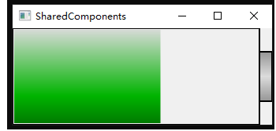
***
- paintButtonBoard
- 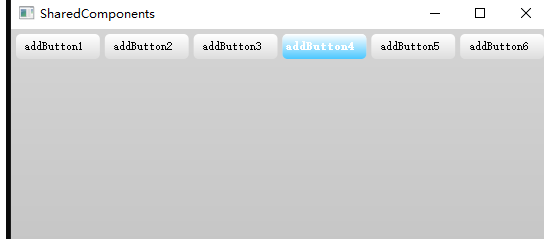
***
- paintChart
- 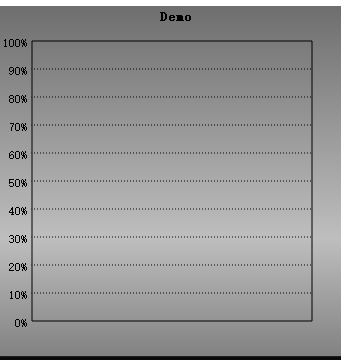
***
- paintCoolBar
- 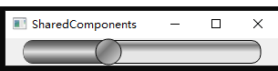
***
- paintFlashList
- 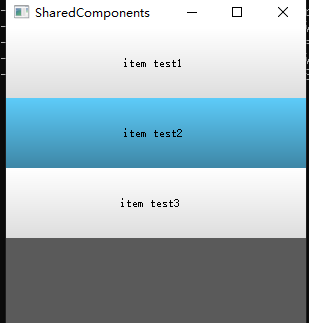
***
- paintGuage
- 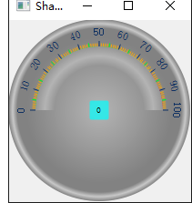
- 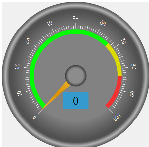
- 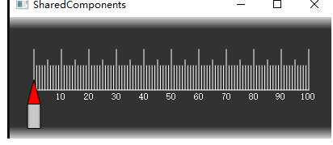
- 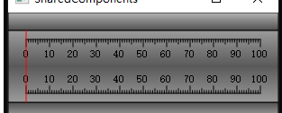
- 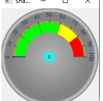
- 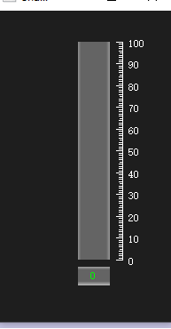
- 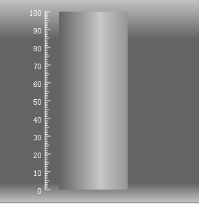
***
- paintInDicator
- 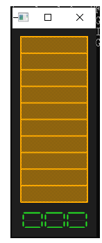
***
- paintProcessBar
- 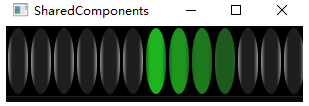
***
- paintSliderButton
- 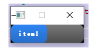
***
- paintSwitchButton
- 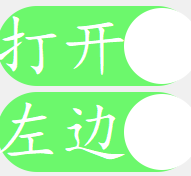
***
- paintVolume
- 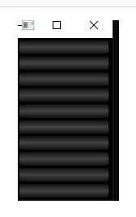
***
- paintWave
- 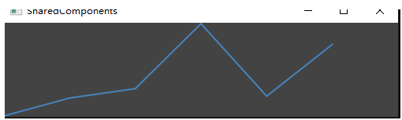
- 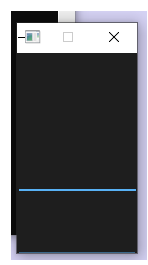
- 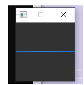