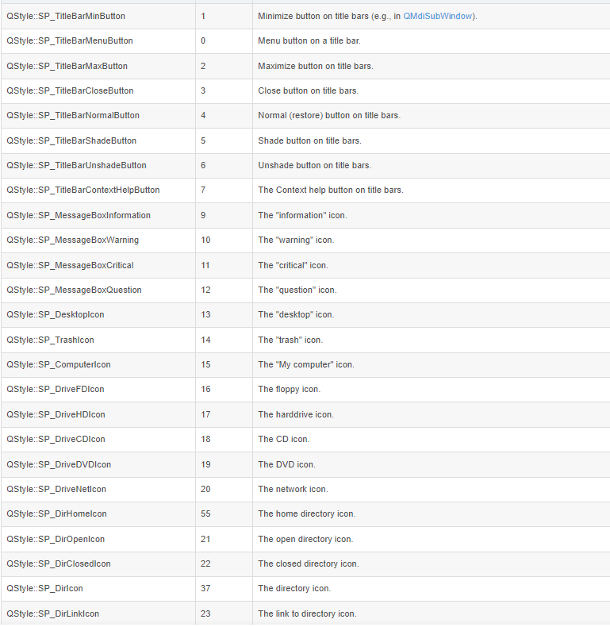
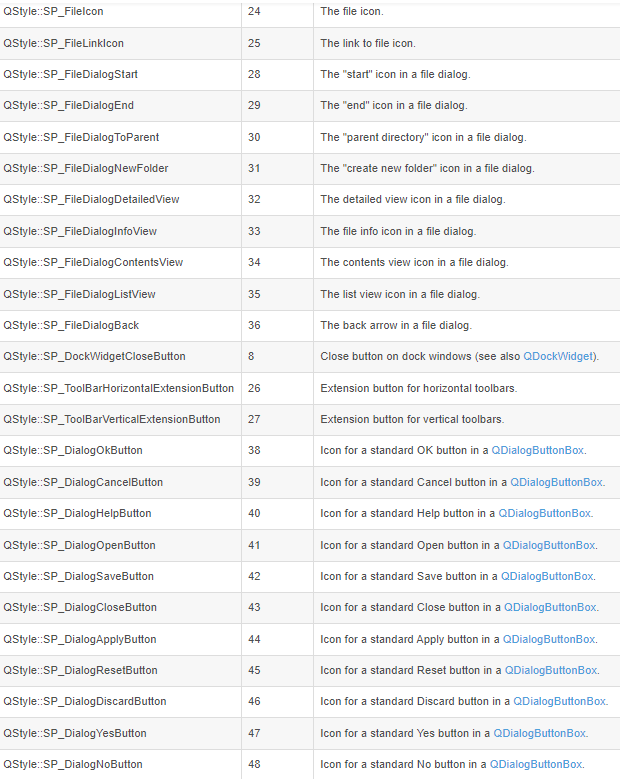
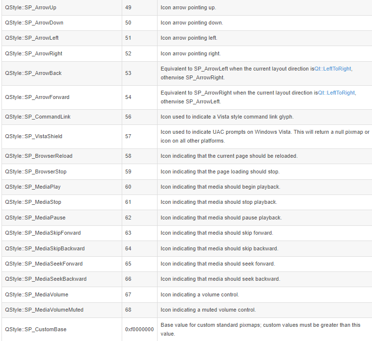
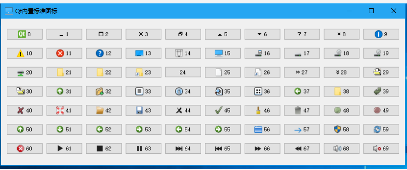
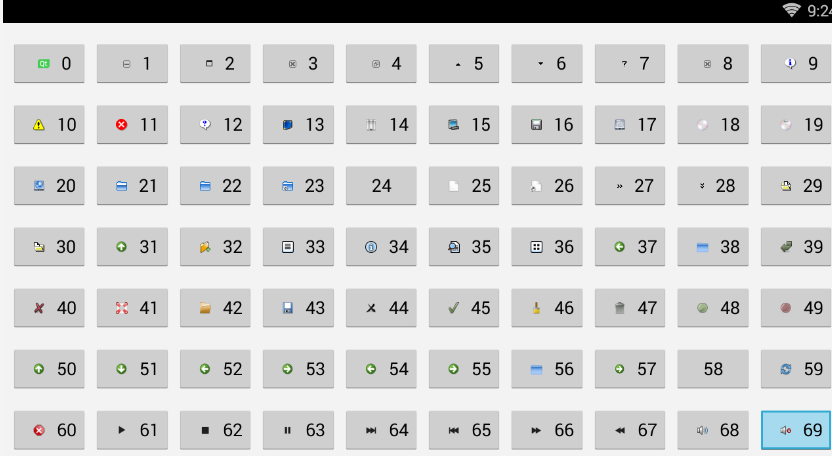
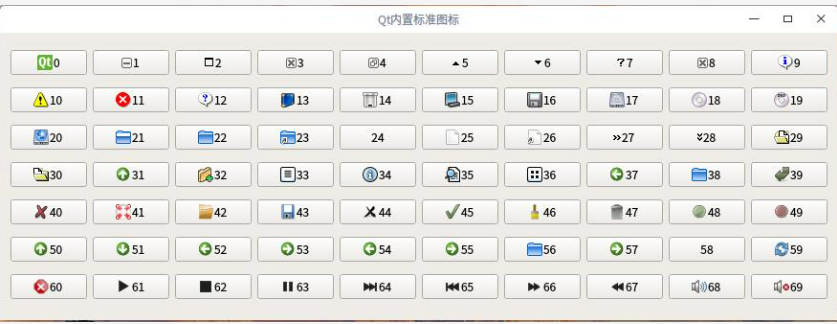
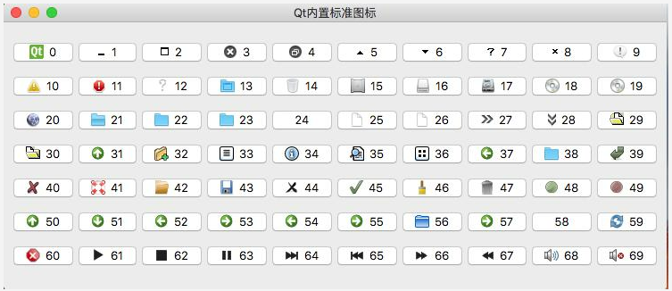

# 内置图标 QIcon
```
	//使用示例
	QPushButton btn("TEST");
	QStyle *style = QApplication::style();
	QIcon icon = style->standardIcon(QStyle::SP_DriveCDIcon);
	btn.setIcon(icon);
```
# 图标宏定义
- WINDOWS平台
- 
- 
- 
# 图标大全
- WIN10 
- 
- Android
- 
- Linux
- 
- Mac
- 