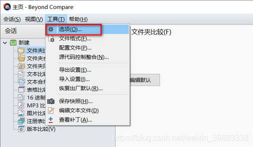
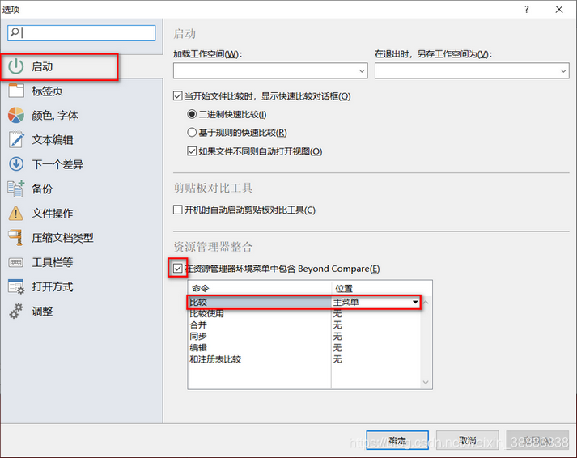

# Beyond compare4 到期处理
* 删除安装目录下的BCUnrar.dll文件
	- C:\Program Files\Beyond Compare 4\BCUnrar.dll,这个文件重命名或者直接删除，则会新增30天试用期，再次打开提示还有28天试用期
* 一劳永逸，修改注册表
	- 在搜索栏中输入 regedit ，打开注册表
	- 删除项目：计算机\HKEY_CURRENT_USER\Software\ScooterSoftware\Beyond Compare 4\CacheId
***

- ubuntu 安装beyond compare 以后
- 使用  bcompare 1.txt 2.txt 打开两份文件进行对比
- 可以到/usr/bin 
	- 使用ln -s /usr/bin/bcompare 	/usr/bin/bcp 建立软连接
	
***
*  //如果是在官网下载好乐安装包的同学，可使用 sudo dpkg -i 安装包.deb 命令安装
	- sudo dpkg -i 安装包.deb

***
* 如果没有在官网下载的，请使用以下步骤安装
	- wget http://www.scootersoftware.com/bcompare-4.2.8.23479_amd64.deb
	- sudo apt-get update
	- sudo apt-get install gdebi-core
	- sudo gdebi bcompare-4.2.8.23479_amd64.deb
***
* 卸载
		- sudo apt-get remove bcompare
***

# 破解1
- 破解只需输入以下两条命令，就可以轻松破解
- bcompare在ubuntu的安装路径是：/usr/lib/beyondcompare/
-  `cd /usr/lib/beyondcompare/`
- ```sudo sed -i "s/keexjEP3t4Mue23hrnuPtY4TdcsqNiJL-5174TsUdLmJSIXKfG2NGPwBL6vnRPddT7tH29qpkneX63DO9ECSPE9rzY1zhThHERg8lHM9IBFT+rVuiY823aQJuqzxCKIE1bcDqM4wgW01FH6oCBP1G4ub01xmb4BGSUG6ZrjxWHJyNLyIlGvOhoY2HAYzEtzYGwxFZn2JZ66o4RONkXjX0DF9EzsdUef3UAS+JQ+fCYReLawdjEe6tXCv88GKaaPKWxCeaUL9PejICQgRQOLGOZtZQkLgAelrOtehxz5ANOOqCaJgy2mJLQVLM5SJ9Dli909c5ybvEhVmIC0dc9dWH+/N9KmiLVlKMU7RJqnE+WXEEPI1SgglmfmLc1yVH7dqBb9ehOoKG9UE+HAE1YvH1XX2XVGeEqYUY-Tsk7YBTz0WpSpoYyPgx6Iki5KLtQ5G-aKP9eysnkuOAkrvHU8bLbGtZteGwJarev03PhfCioJL4OSqsmQGEvDbHFEbNl1qJtdwEriR+VNZts9vNNLk7UGfeNwIiqpxjk4Mn09nmSd8FhM4ifvcaIbNCRoMPGl6KU12iseSe+w+1kFsLhX+OhQM8WXcWV10cGqBzQE9OqOLUcg9n0krrR3KrohstS9smTwEx9olyLYppvC0p5i7dAx2deWvM1ZxKNs0BvcXGukR+/g" BCompare ```
- 然后打开Beyond Conpare，弹出Trial Mode Error！弹窗
- 单击右下角按钮“Enter Key”，输入以下秘钥【注意：包括开始和结尾的横线行】
- 输入
```
--- BEGIN LICENSE KEY ---
GXN1eh9FbDiX1ACdd7XKMV7hL7x0ClBJLUJ-zFfKofjaj2yxE53xauIfkqZ8FoLpcZ0Ux6McTyNmODDSvSIHLYhg1QkTxjCeSCk6ARz0ABJcnUmd3dZYJNWFyJun14rmGByRnVPL49QH+Rs0kjRGKCB-cb8IT4Gf0Ue9WMQ1A6t31MO9jmjoYUeoUmbeAQSofvuK8GN1rLRv7WXfUJ0uyvYlGLqzq1ZoJAJDyo0Kdr4ThF-IXcv2cxVyWVW1SaMq8GFosDEGThnY7C-SgNXW30jqAOgiRjKKRX9RuNeDMFqgP2cuf0NMvyMrMScnM1ZyiAaJJtzbxqN5hZOMClUTE+++
--- END LICENSE KEY -----
```

***
# 破解2
 - //bcompare在ubuntu的配置文件的路径是：.config/bcompare
- cd .config/bcompare/
- //在该路径下找到 registry.dat 删除即可
- rm registry.dat
- 删除以后重新获得30天的使用

***
# 将Beyond Compare添加到系统右键菜单

- 步骤一：打开Beyond Compare软件，点击上方的“工具”菜单，选择“选项”命令
- 
- 
- 步骤二：左侧选择“启动”栏目，右侧勾选“在资源管理器环境菜单中包含Beyond Compare”，并在“比较”命令右边位置点击下拉按钮，选择主菜单
- 
- 点击确定就OK了。