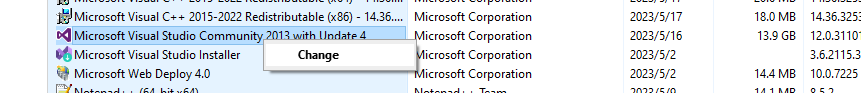
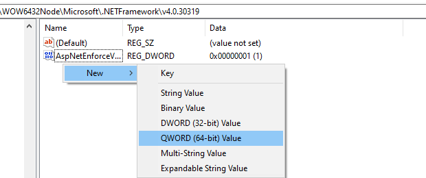
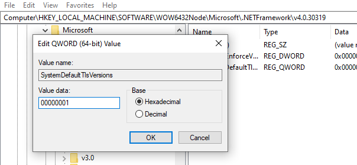
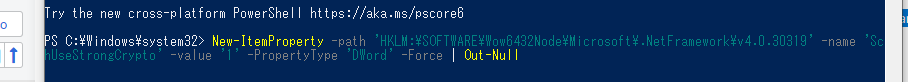

# vs登录  the online service is not available
# sign in, sorry, we ran into a problem
# license无法输入

# 1. 清除旧的账号登陆信息
- A.  进入vs2013的安装目录C:\Program Files\Microsoft Visual Studio\2013\Professional\Common7\IDE
- B. 以管理员身份打开这个路径的cmd(或者以管理员身份打开Developer Command Prompt for VS2013)
- **C. 找到devenv.exe， 在cmd窗口输入 devenv /resetuserdata**
- **D. 如果以上方案不行，regedit打开注册表，试试删除，
hkey_current_user\software\Microsoft\VSCommon\12.0\clientservices\tokenstorge\visualstudio\ideuser Mark， 只保留一个default**
# 2. 修复、
- A. 打开控制面板，右键，change -> repair
- 
- B. 修复完成以后关闭，等待几分钟重新启动

# 3. 重新登陆
- **A. regedit打开注册表**
- 
```
Computer\HKEY_LOCAL_MACHINE\SOFTWARE\WOW6432Node\Microsoft\.NETFramework\v4.0.30319
```
- 
- 添加SystemDefaultTlsVersions， 然后设置值为00000001
- 添加SchUseStrongCrypto，然后设置值为00000001


- **B. 以管理员身份运行 PowerShell, 然后执行命令**
```
New-ItemProperty -path 'HKLM:\SOFTWARE\Wow6432Node\Microsoft\.NetFramework\v4.0.30319' -name 'SchUseStrongCrypto' -value '1' -PropertyType 'DWord' -Force | Out-Null
```
- 
- 