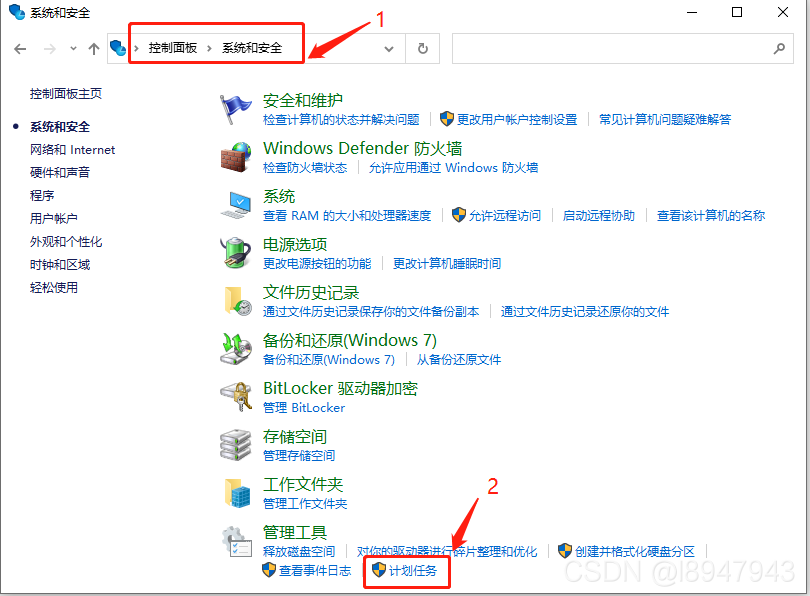
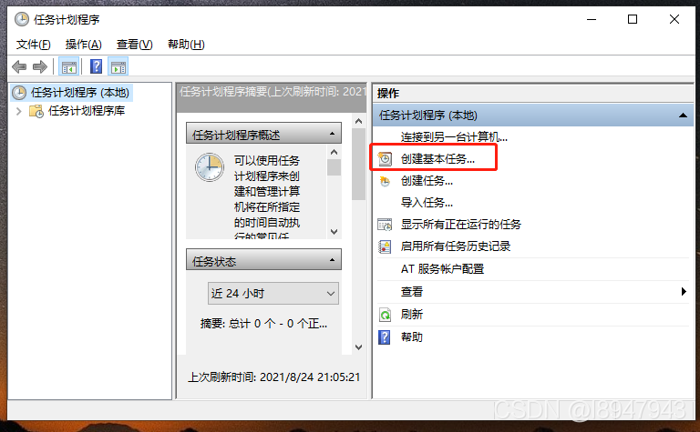
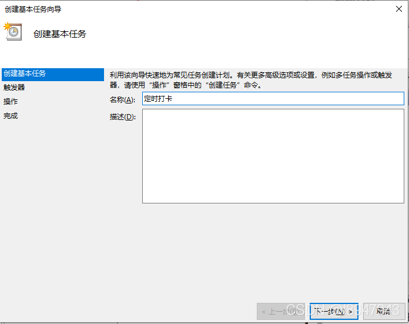
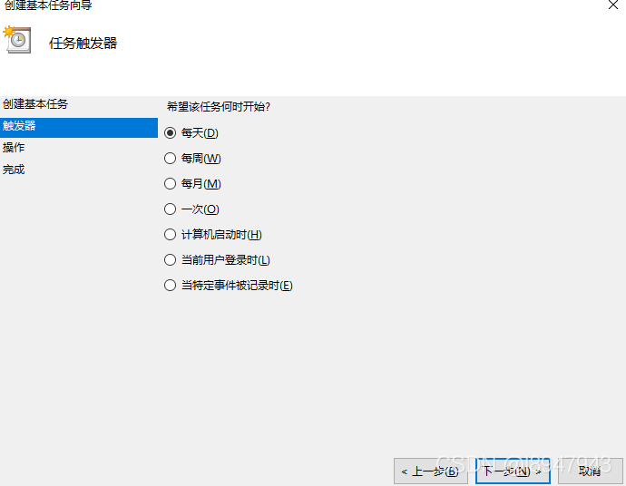
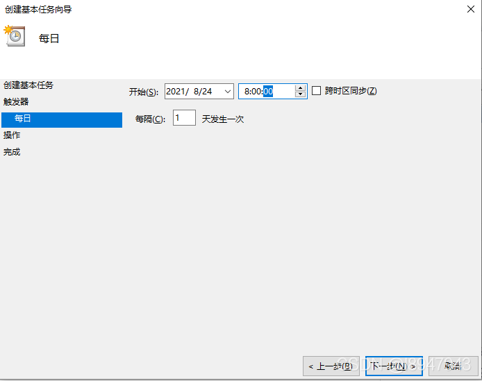
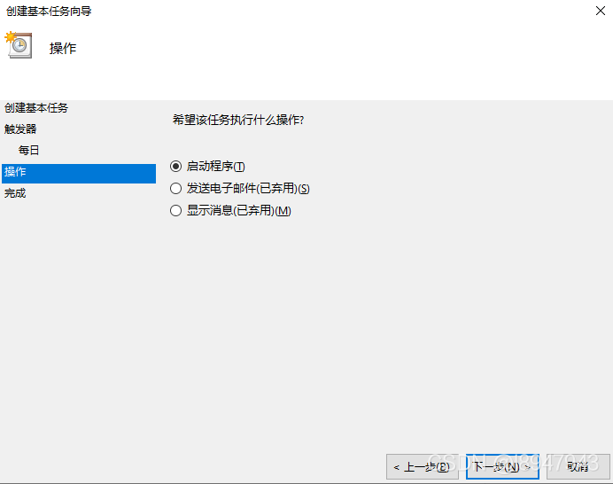
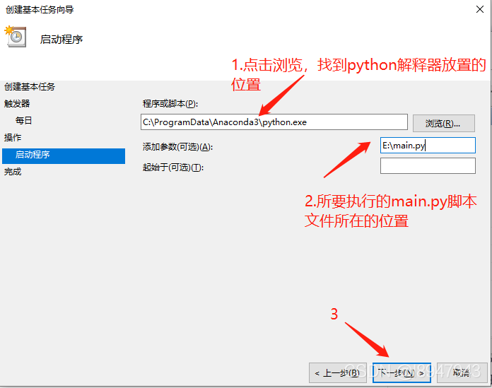
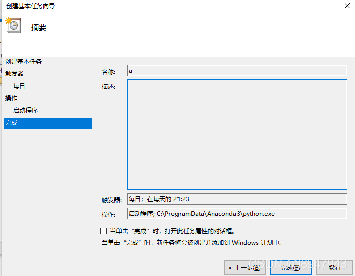

# 实现Windows下设置定时任务来运行python脚本
 
1. 自己用python写了一个签到脚本
经过测试已经可以成功打卡，于是研究了一下windows定时运行程序

2. 创建定时任务
2.1 打开“控制面板 ”C>“系统和安全”C>“管理工具”C>“计划任务”

在这里插入图片描述

2.2 打开“计划任务”，如图，点击“创建基本任务”

2.3 给定时任务命名，点击下一步

2.4 选择脚本执行的时间，以每天执行为例，如图，点击下一步

2.5 选择具体的每天执行时间
如从2021年8月24日起，后面每天早上8点执行定时任务，如图，点击下一步

2.6 以执行程序为例，选择启动程序
点击下一步

2.7 选择启动程序
填写参数如图：

表示用位置：C:\ProgramData\Anaconda3\python.exe的解释器执行 E:\main.py脚本文件。

2.8 点击完成即可生成定时任务

***

#  查看已经创建的任务
- 控制面板 - 系统和安全 - 任务计划程序库
